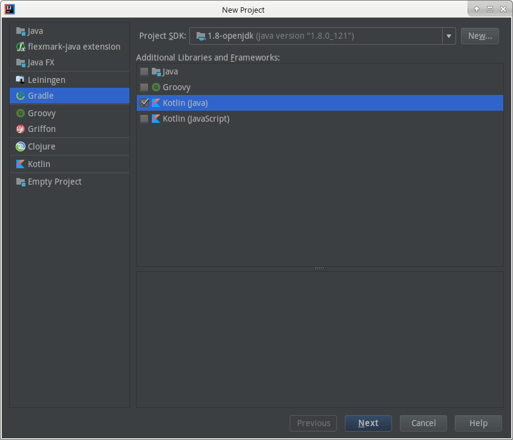

## 太過簡單的介紹

[Kotlin](https://kotlinlang.org/) 雖然很多人說它是 Java 界的 [Swift](https://swift.org/)，而 JetBrains 團隊其實也將它大舉用在 Android 開發上。但我想，Kotlin 就是 Kotlin，就像在 JVM scripting language 裡，Groovy、Scala、Kotlin、Clojure、Ceylon 各有其特殊地位，我們無法說 Scala 與 Clojure 是 functional language，就說這兩個一樣。類比有時能讓我們容易理解與學習事物，但往往也會讓我們迷失了各自的本質。但若你要這麼說，那倒也不是不行啦。我們直接看 Kotlin 官方的定義：

> Statically typed programming language for the JVM, Android and the browser
> - [Kotlin lang](https://kotlinlang.org/)

## 必先利其器

會開始研究 Kotlin 不是因為我想開發 Andriod，而是我是 [JetBrains Intellij IDEA](https://www.jetbrains.com/idea/) 的使用者。因此對於那個常常從眼前掠過的新語言，有些許好奇之心，而因此開啟 Kotlin 的開發之路。也因為這個緣故，Kotlin 的開發首選的工具，便是 Intellij 了。然而，它仍有支援 [Eclipse](http://www.eclipse.org/) 的[Plugin](https://kotlinlang.org/docs/tutorials/getting-started-eclipse.html)。

## 專案結構

Kotlin 如同其他的 scripting language 一樣，它不需要太過嚴謹的檔案組織關係，即可做些簡單的事。但它又與其他 scripting language 不同之處，在於基於 JVM 的這項特性，可以使用 Java 廣大的 ecosystem。因此，它也可以使用 [Maven](http://maven.apache.org/) 或 [Gradle](https://gradle.org/) 這類工具進行專案結構管理與相依性管理，更可以使用 Java 的各種 [3rd party library](https://mvnrepository.com/) 來開發。因此，這篇雖然要從 Kotlin 的基本概念著手，但我們會更進一步地使用 Gradle 作為專案結構與相依管理的工具。

## 第一個程式

很多人習慣拿 HelloWorld 來當第一個程式的示範，這當然無可厚非。良葛格在他的 [Python 技術手冊](https://www.tenlong.com.tw/products/9789864761265) 說到，接觸一個新的語言，會先看它的中文處理能力。我則是習慣寫一個很簡單的排序法 - [氣泡排序法](https://zh.wikipedia.org/wiki/%E5%86%92%E6%B3%A1%E6%8E%92%E5%BA%8F)。在這個排序法裡，有 for 迴圈，有 iterator(雖然是使用陣列)，有 if，還有變數宣告與代換。若再把它包裝一下，還可以看出 class 與 method 的寫法。氣泡排序法的基本 Java 寫法如下，我們接下來會把它改成 Kotlin 的寫法：

```java
public int[] bubbleSort(int[] instances){
    for(int i = 0; i < instances.length - 1; i++){
        for(int j = i + 1; j < instances.length; j++) {
            if( instance[j] < instance[i] ) {
                int temp = instances[i];
                instances[i] = instances[j];
                instances[j] = temp;
            }
        }
    }
}
```

## 新案建成

我會使用 Intellij IDEA CE 版來建構專案。首先開啟 IDE 後，執行 _Create New Project_，然後你會看到一個專案設定畫面：


我們選左邊的 Gradle，再選右上的 Java 執行環境為 Java 8 (OpenJDK 或 OracleJDK 都可以)，再選中間的語言，只勾起 Kotlin，最後會像這樣：



下一步後，輸入專案的名稱：


然後設定一下 Gradle 的執行環境：


最後設定好你的專案要放哪裡後，我們就完成了專案的初始化了。

## 檢查設定

Intellij IDEA 給了我們最初的 Gradle 設定，大概如下：

```groovy
group 'kotlin.demo'
version '1.0-SNAPSHOT'

buildscript {
    ext.kotlin_version = '1.1.2-2'

    repositories {
        mavenCentral()
    }
    dependencies {
        classpath "org.jetbrains.kotlin:kotlin-gradle-plugin:$kotlin_version"
    }
}

apply plugin: 'kotlin'

repositories {
    mavenCentral()
}

dependencies {
    compile "org.jetbrains.kotlin:kotlin-stdlib-jre8:$kotlin_version"
}
```

從內容可以看到，要執行 Kotlin 相關的程式，需要 Kotlin 的 plugin，而語言的版本，也設定在 plugin 的 buildscript 區塊中。

這樣，它能執行嗎？我們試試看。

## HelloWorld

對，我們還是得先寫個 HelloWorld，來試試環境是否正確設置：

**src/main/kotlin/Main.kt**

```kotlin
fun main(args: Array<String>) {
    println("Hello World!")
}
```

在 command line 下執行：```gradle clean build```，我們會發現它已經可以正確建置：

```console
Starting a Gradle Daemon (subsequent builds will be faster)
:clean
:compileKotlin
Using kotlin incremental compilation
:compileJava NO-SOURCE
:copyMainKotlinClasses
:processResources NO-SOURCE
:classes UP-TO-DATE
:jar
:assemble
:compileTestKotlin NO-SOURCE
:compileTestJava NO-SOURCE
:copyTestKotlinClasses
:processTestResources NO-SOURCE
:testClasses UP-TO-DATE
:test NO-SOURCE
:check UP-TO-DATE
:build

BUILD SUCCESSFUL

Total time: 30.376 secs
```

但它怎麼執行呢？我們在 gradle 的 build/libs 下，會發現一個 jar 檔：

```console
➜  libs git:(kotlin-basic) ✗ pwd
/home/gemhuang/Public/kotlin-demo/kotlin-basic/build/libs
➜  libs git:(kotlin-basic) ✗ ll
total 4.0K
-rw-r--r-- 1 gemhuang gemhuang 1.2K May 16 07:03 kotlin-basic-1.0-SNAPSHOT.jar
```

如果直接執行這個 jar 檔呢？

```console
➜  libs git:(kotlin-basic) ✗ java -jar kotlin-basic-1.0-SNAPSHOT.jar
no main manifest attribute, in kotlin-basic-1.0-SNAPSHOT.jar
```

它會跟你說沒有 main！好吧，那我們怎麼辦？

因為 jar 是一種 zip 的格式，我們把它解壓縮來看看：

```console
unzip kotlin-basic-1.0-SNAPSHOT.jar -d kotlin-basic
```

```console
➜  libs git:(kotlin-basic) cd kotlin-basic
➜  kotlin-basic git:(kotlin-basic) ls
MainKt.class  META-INF
```

在這個 jar 檔裡，我們可以找到一個 MainKt 的 class 檔，這代表什麼呢？因為 Kotlin 是 JVM 的一支 scripting language，因此它仍需要按照 JVM 的規範：以 class 為程式的單位。再回到之前寫的那個沒有寫 ```public class``` 的程式，當 Kotlin 碰到這種沒有寫 class 的程式，便自動地幫它建立一個 class 名稱－MainKt。換句話說，MainKt 是否是我們的 main 呢？我們來執行看看：

```console
➜  kotlin-basic git:(kotlin-basic) cd ..
➜  libs git:(kotlin-basic) ✗ ls
kotlin-basic  kotlin-basic-1.0-SNAPSHOT.jar
➜  libs git:(kotlin-basic) ✗ java -cp .:kotlin-basic-1.0-SNAPSHOT.jar MainKt
Exception in thread "main" java.lang.NoClassDefFoundError: kotlin/jvm/internal/Intrinsics
	at MainKt.main(Main.kt)
Caused by: java.lang.ClassNotFoundException: kotlin.jvm.internal.Intrinsics
	at java.net.URLClassLoader.findClass(URLClassLoader.java:381)
	at java.lang.ClassLoader.loadClass(ClassLoader.java:424)
	at sun.misc.Launcher$AppClassLoader.loadClass(Launcher.java:331)
	at java.lang.ClassLoader.loadClass(ClassLoader.java:357)
	... 1 more
```

執行時雖然沒有再爆出找不到 main 的訊息，證實了我們剛剛的猜測，但又發生了一個奇怪的意外：它找不到 ```kotlin.jvm.internal.Intrinsics``` 這個 class！我們從剛剛解開的 jar 檔裡，沒有看到其他的 class 或 jar 檔，那這個 class 在哪裡呢？

> 有沒有人 google 一下？

我們要回頭看 Gradle 的設定檔，然後加入把 compile 相依打包進這個 jar 檔的設定：

```groovy
jar {
  from { configurations.compile.collect { it.isDirectory() ? it : zipTree(it) } }
}
```

然後執行同樣的步驟試試：

```console
➜  kotlin-basic git:(kotlin-basic) ✗ cd build/libs
➜  libs git:(kotlin-basic) ✗ java -cp .:kotlin-basic-1.0-SNAPSHOT.jar MainKt
Hello World!
```

實際執行如下圖：


順手把 MainKt 也加入 Gradle 的 jar 設定中：

```groovy
jar {
  manifest {
      attributes "Main-Class": "MainKt"
  }
  from { configurations.compile.collect { it.isDirectory() ? it : zipTree(it) } }
}
```

再執行一次：

```console
➜  kotlin-basic git:(kotlin-basic) ✗ gradle clean build
➜  kotlin-basic git:(kotlin-basic) ✗ cd build/libs
➜  libs git:(kotlin-basic) ✗ java -jar kotlin-basic-1.0-SNAPSHOT.jar
Hello World!
```

如圖：


好了，我們已經建立了一個基本的執行模式與基礎架構，好讓我們可以開發最基本的 Kotlin 程式。

但，你或許不覺得怪怪的，但我覺得挺怪的：當代的軟體工法皆奠基於測試之上，Kotlin 的開發難道可以免除嗎？Kotlin 的開發怎麼做測試呢？

## Kotlin Test

因為 Kotlin 是基於 JVM 的 scripting language，所以通常做測試，還是會從 jUnit 入手：

```groovy
dependencies {
    compile "org.jetbrains.kotlin:kotlin-stdlib-jre8:$kotlin_version"

    testCompile "junit:junit:4.12"
}
```

我們在 ```src/test/kotlin``` 下，寫一個 main 的測試：

**MainTest.kt**

```kotlin
class MainTest{
    @Test
    fun testMain(){
        main(emptyArray())
    }
}
```

這樣，我們就建立了一個基本的測試了。裡面的關鍵字與函式，我們稍後就會進行說明。

## 相依性

到現在，我們已經可以建立一個簡單的 kotlin 程式，並且撰寫它的單元測試，但若要更深入地了解系統的結構，我們仍然有必要把它的相依性拆解出來認識一下：

```console
compileClasspath - Compile classpath for source set 'main'.
\--- org.jetbrains.kotlin:kotlin-stdlib-jre8:1.1.2-2
     \--- org.jetbrains.kotlin:kotlin-stdlib-jre7:1.1.2-2
          \--- org.jetbrains.kotlin:kotlin-stdlib:1.1.2-2
               \--- org.jetbrains:annotations:13.0

...

testCompileClasspath - Compile classpath for source set 'test'.
+--- org.jetbrains.kotlin:kotlin-stdlib-jre8:1.1.2-2
|    \--- org.jetbrains.kotlin:kotlin-stdlib-jre7:1.1.2-2
|         \--- org.jetbrains.kotlin:kotlin-stdlib:1.1.2-2
|              \--- org.jetbrains:annotations:13.0
\--- junit:junit:4.12
     \--- org.hamcrest:hamcrest-core:1.3
```

透過執行 ```gradle dependencies``` 這指令，我們可以找到這個專案各個階段的相依套件。在主要開發編譯相依的套件裡，我們看到幾個 kotlin 核心的套件：

* kotlin-stdlib-jre8
* kotlin-stdlib-jre7
* kotlin-stdlib
* annotations

這些套件便是提供開發者得以撰寫 Kotlin 的程式的最小相依套件。測試方面，則多了以下兩項：

* junit
* hamcrest-core

除了 Kotlin 相關的套件外，其他我想對於有經驗的 Java 開發者而言都是很熟悉的，因此我們可以準備進入正式開發階段。

## 一個簡單的排序程式

在此，我們不會做太複雜的程式，因為目的不在此。我們只需要把一個充滿著隨機整數的陣列傳給排序程式，然後排成遞增的次序。而在此，就會看到 Kotlin 在呼叫 Java 物件、建立物件、基本程式流程、宣告變數、宣告函式等程式語言中最基礎的用法。

排序的原理，也不做解釋，這個演算法真的挺簡單的。我們從排序程式與它的測試先來吧：

**SortTest.kt**

```kotlin
const val MAX: Int = 10240  // 註 1
const val SIZE: Int = 1000

class SortTest {  // 註 2

    @Test  // 註 3
    fun testBubbleSort() {  // 註 4
        var instances = prepareInstances()  // 註 5

        instances = bubbleSort(instances)  // 註 6

        verifySortedInstances(instances)
    }

    private fun prepareInstances(): Array<Int> = Array(SIZE, { Random().nextInt(MAX) })  // 註 7

    private fun verifySortedInstances(instances: Array<Int>) {  // 註 8
        var less = instances[0]  // 註 9

        for (i in 1..instances.size - 1) {  // 註 10
            var larger = instances[i]

            Assert.assertTrue(less <= larger)

            less = larger
        }
    }
}
```

**Sort.kt**

```kotlin
fun bubbleSort(instances: Array<Int>): Array<Int> {  // 註 11
    for (i in 0..instances.size - 2) {
        for (j in i + 1..instances.size - 1) ascend(instances, i, j)
    }

    return instances
}

fun ascend(instances: Array<Int>, pre: Int, nxt: Int) {
    if (instances[pre] > instances[nxt]) {
        val temp = instances[pre]  // 註 12
        instances[pre] = instances[nxt]
        instances[nxt] = temp
    }
}
```

## 簡單說明

程式裡的註解點，就是我們接下來要說明的地方。

### 變數的 2.5 種類型

參：註 1、註 5、註 12

kotlin 變數的宣告基本上分為兩種，可變的與不可變的。按 Kotlin 官方文件所述：

> Assign-once (read-only) local variable & Mutable variable
> - [Kotlin - Basic Syntax](https://kotlinlang.org/docs/reference/basic-syntax.html)

我們在測試程式的開頭，而且是 class 的外部，宣告了兩個看起來像 Java 裡 ```public static final``` 的東西，然而在 Kotlin 裡面是沒有 static 這個概念的，如同 Kotlin Blog 上的一篇所說到：

> Kotlin is designed so that there’s no such thing as a “static member” in a class. If you have a function in a class, it can only be called on instances of this class. If you need something that is not attached to an instance of any class, you define it in a package, outside any class (we call it package-level functions)
> - [Kotlin Blog - “Static constants” in Kotlin](https://blog.jetbrains.com/kotlin/2013/06/static-constants-in-kotlin/)

因此在 Kotlin 裡，若要定義常數，必須寫在 class 的定義之外。於是就像 _註 1_ 的寫法一樣，把定義寫在 TestClass 的外頭。這個 ```const``` 指定了一個專屬於常數的特性：編譯時即賦值。而 ```val``` 則是 Kotlin 所說的，這是一個一次性賦值、唯讀、區域性的變數宣告。換句話說，如果你在 method 裡頭，或 class 裡頭，想要非正式地設定一個數字，它不是像 PI = 3.1415926 那樣通用，只是在程式碼區塊中用得到的，賦值了之後就不希望被改動到，那麼可以使用 ```val``` 的定義，如同 _註 12_ 的使用。

但另一個我想是更常用的，就是可變的變數。像 _註 5_ 那樣，這變數設了之後，其值或參考到的物件，是可以變動的。因此，它可以指定給一些會不斷變動的，像 index、count 之類的變數使用。

其實實際在寫 Kotlin 時，我常常會分不清什麼時候用 ```val``` 或什麼時候用 ```var```，但在我的觀念裡，固定的比變動的更好。雖然現代的開發思維都傾向靈活、可變，但其實在寫程式時，固定的、不可變的，還是比可變的更穩定，可讀性也更高。如果你在寫的時候，一開始不是很確定，就全用 ```var``` 試試，然後再把一些不會被重新賦值的數值或物件改為 ```val```，執行沒問題後，回頭再讀讀看程式碼，或許你會明白為何 Kotlin 會這樣設計變數的兩大類型。

### 從 jUnit 看 Kotlin 的類別

參：註 2

Kotlin 的類別有數種不同的變異，而這些會在後續的內容中說明。但我在寫 jUnit 時，心裡有一個很大的問題。各位看到的這些測試程式，其實是 try-error 之後寫出來的，一開始是沒有外部的 class 區塊定義的，例如像一開始的測試，原本是這樣寫著的：

**MainTest.kt (original)**

```kotlin
@Test
fun testMain() {
    main(emptyArray())
}
```

這樣寫了之後，我發現 jUnit 的執行程式並不領情，而且在 Gradle 建置階段就會出現錯誤。後來便找了找網路上的範例，幫它加上了個 class 定義，成為後來的樣子，才真的過了關。這點讓人很好奇，為何 jUnit 的程式，必須包在一個「具名」的類別中執行呢？我說具名，是因為各位還記得，我們在最初試著執行 main 函式時，曾把 jar 檔解壓縮來看過，裡頭有一個 ```MainKt.class``` 嗎？這其實是在 Kotlin 中，為沒有宣告 class 的程式所給定的預設類別名稱，在程式的語義裡，可說是一種「不具名」的類別：它雖然不特意宣告 class，但也不刻意匿名。然而，main 可以放在這樣的預設命名，甚至是不刻意命名的類別中，但 jUnit 的測試函式呢？雖然我沒有找到最根本的說明，但從許多人的寫作範例來看，jUnit 的測試函式，必須放在一個「具名」且「刻意」命名的類別中。換句話說，你可以為它取各種名字，不與檔名相同也可以，但一定要命名。

Kotlin 裡的類別，像它的各個兄弟與父執輩語言一樣，用 ```class``` 關鍵字定義，並用 ```{}``` 包裹住它的內容。關於類別的更深一層應用，我們會在後續內容中說明。

### Annotations

參：註 3

Annotation 是 Java 語言的一個特性，它在其他的語言平台上，也有各自的稱呼，或叫 decorator，或叫 attribute；它們不管稱呼什麼，皆是用來定義程式的附註資訊，或可以說是 metadata。Kotlin 在這一個使用方式上，沒有做太大的改變，一樣是使用 ```@``` 符號作為 annotation 的開頭。Annotation 的定義屬於較深的議題，就不再這裡討論。

### Kotlin 的型別宣告

參：註 1、註 7、註 8、註 11

Kotlin 的型別宣告方式，很像 Pascal 或 Basic，它們皆把變數或 function 名稱放前面，類型放後面，Pascal 中間使用冒號分開，Basic 則多了個冗長的關鍵字。如同註 1 所示:

修飾子(範圍/類型) | 名稱 | 型別 | 賦值
 ---- | ---- | ---- | ----
```const val``` | ```MAX``` | **:** ```Int``` | **=** ```10240```

這樣的寫法，在 function/method 的宣告也是一樣，如同註 11 所示：

修飾子(範圍/類型) | 名稱 | 型別
 ---- | ---- | ----
```fun``` | ```bubbleSort``` (參數略) | **:** ```Array<Int>```

### Kotlin 的 method 與 function

參：註 4、註 7、註 8、註 11

先定義一下我所使用的這兩個字的差異，function 指的是在程式語言裡面的一個小型區塊，裡頭寫了特定用途的一組程式，而 method 是指定義在 object、class 裡面，作為表示物件行為的 function，而 function 也用來代表 functional programming 裡的 function。為免語意模糊，我會盡量用英文名詞。

而 Kotlin 的 function 定義，很簡單地打一個 ```fun``` 即可，如「註 4」所示：

```kotlin
fun testBubbleSort() {
}
```

這個 function 沒有回傳值嗎？在 Java 沒有回傳值的 function 要定義為 ```void```，而在 Kotlin 裡沒有回傳值的 function 也一樣要定義為 ```Unit```，但卻可省略。

Kotlin 是一種可以實現 functional programming 概念的程式語言，雖然註 7 的寫法是一種簡單的回傳簡寫方式，但它也反映了這個語言處理 function 的思維：

```kotlin
private fun prepareInstances(): Array<Int> = Array(SIZE, { Random().nextInt(MAX) })

// 可寫成:

private fun prepareInstances(): Array<Int>{
    return Array(SIZE, { Random().nextInt(MAX) })
}
```

### Kotlin 的類別與物件

參：註 2、註 7

Kotlin 本身是個混合了物件導向與函數式的程式語言，它比 JavaScript 嚴謹，但比 Java 更靈活。它有相當完整，但輕量的類別定義方式，我們在這裡，只會看到最基本的寫法。

如同註 2 與 **MainTest.kt** 所示，在 jUnit 裡面必須以一個具名類別包住測試 function，因此我們不得不在此加上一個類別的宣告：

```kotlin
class SortTest {
}
```

Kotlin 是一個可以做 functional programming 的語言，雖然不像 scala 或 clojure 那麼徹底。而 Kotlin 的 function 定義，很簡單地打一個 ```fun``` 即可，如「註 4」所示。而每個 function 都需要面對的回傳值，Kotlin 不像 Groovy 或 Ruby 那樣，可以由底層去猜測其回傳的內容。因此在寫的時候，要像 Java 一樣，明確說明回傳值，除非今天是不用回傳的函式(```Unit```)。可以參考其文件所說明：

>Explicit return types
>Functions with block body must always specify return types explicitly, unless it's intended for them to return Unit, in which case it is optional. Kotlin does not infer return types for functions with block bodies because such functions may have complex control flow in the body, and the return type will be non-obvious to the reader (and sometimes even for the compiler).
> [Kotlin - Functions - Explicit return types](https://kotlinlang.org/docs/reference/functions.html#explicit-return-types)

### Kotlin 的資料型態

在這個範例中，我們會使用到兩種資料型態，或說一種資料型態，一種資料結構。型態指的是 Int (整數)，結構指的是 Array (陣列)。Kotlin 是一種靜態強型別語言，雖然可以用 var 或 val 來設定變數，但變數型別一旦設定，就無法改變。不信，可以打這一段試試：

```kotlin
var test = 123
test = "abc"
```

這樣是無法通過編譯的，連 IDE 的語法檢查都過不去。一個 Int，可以這樣宣告：```var a: Int = 123```，或簡單地：```var a = 123```；而很多的 Int 組合在一起，這就成了資料結構的概念，這範例使用到一個最基本的資料結構：Array。宣告一個 Int 的陣列，可以這麼寫：```var values: Array<Int> = 

### Kotlin 的 range 與 for-loop

